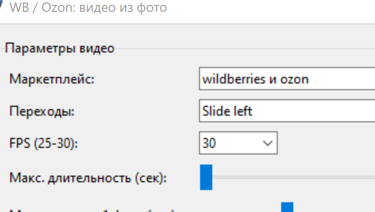
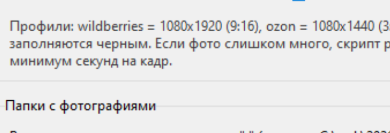

# WB / Ozon Video Maker

Локальный `Python`-скрипт с GUI для сборки товарных видео из фотографий под маркетплейсы `Wildberries` и `Ozon`.

## Что умеет

- Собирает видео из фото в формате `.mp4` (`H.264`, `yuv420p`).
- Обрабатывает сразу несколько папок с изображениями.
- Поддерживает режимы:
  - `wildberries` (9:16, `1080x1920`)
  - `ozon` (3:4, `1080x1440`)
  - `wildberries и ozon` (создает оба варианта)
- Поддерживает переходы:
  - `Slide left` (по умолчанию)
  - `Push left`
  - `Swipe left`
  - `Cross Fade`
  - `Spin Blur`
  - `Shake`
  - `Glitch`
- Позволяет ограничить:
  - максимальную длительность ролика (`10`–`180` сек),
  - минимальное время показа 1 фото (`0.5`–`10` сек, по умолчанию `1.5` сек).
- Если фото слишком много, скрипт равномерно выбирает часть кадров, чтобы не нарушать ограничение по минимальному времени на фото.
- Если фото не помещается в кадр, оно вписывается полностью, а свободные области заполняются черным.

## Скриншоты

### Основной экран



### Поле с папками и ручной вставкой путей



## Требования

- Windows
- Python `3.10+`
- `ffmpeg` в `PATH`

Проверка:

```powershell
python --version
ffmpeg -version
```

## Запуск

### Первый запуск на новом ПК

1. Установите Python `3.10+` (с опцией `Add python.exe to PATH`).
2. Установите `ffmpeg` и добавьте `C:\ffmpeg\bin` в `PATH`.
3. Откройте папку проекта:
   ```powershell
   cd "<путь_к_папке_проекта>"
   ```
4. Запустите:
   ```powershell
   python marketplace_video_maker.py
   ```

### Повторный запуск (если уже настраивали ранее)

```powershell
cd "<путь_к_папке_проекта>"
python marketplace_video_maker.py
```

## Как пользоваться

1. Выберите маркетплейс.
2. Добавьте папки с фото:
   - вставкой путей вручную,
   - либо кнопкой `Добавить папки (мультивыбор)`.
3. Выберите переход, FPS и ограничения по длительности.
4. Нажмите `Собрать видео`.

Готовые видео создаются рядом с фото, например:

- `ИмяПапки_wildberries.mp4`
- `ИмяПапки_ozon.mp4`

## Безопасность и предостережения

Скрипт локальный и не отправляет данные в интернет, но это не означает «полностью безопасно».

Основные риски:

1. Используется внешний бинарник `ffmpeg` из `PATH`. Если в `PATH` подменен `ffmpeg.exe`, может выполниться нежелательный код.
2. Обработка недоверенных изображений через мультимедиа-библиотеки всегда имеет риск уязвимостей декодера.
3. В логах и путях могут быть локальные директории пользователя (персональные пути).
4. Очень большие наборы фото создают высокую нагрузку на CPU/диск.

Рекомендации:

1. Ставьте `ffmpeg` только из доверенного источника и обновляйте его.
2. Обрабатывайте только доверенные фото.
3. Не запускайте скрипт от администратора без необходимости.
4. Перед публикацией репозитория проверяйте, что в коммит не попали личные файлы и локальные пути.

## Файлы проекта

- `marketplace_video_maker.py` — основной скрипт.
- `как запустить.txt` — подробная инструкция запуска.
